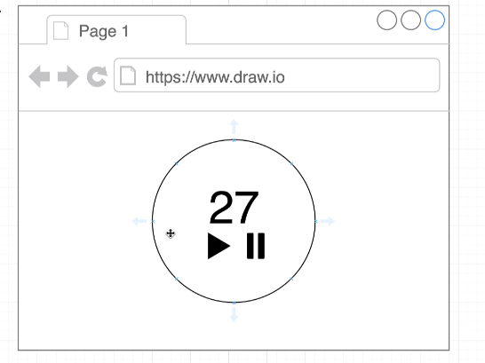
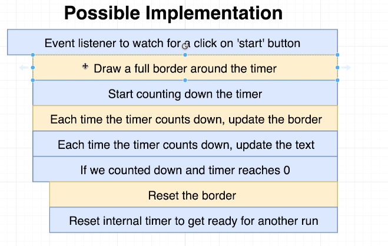
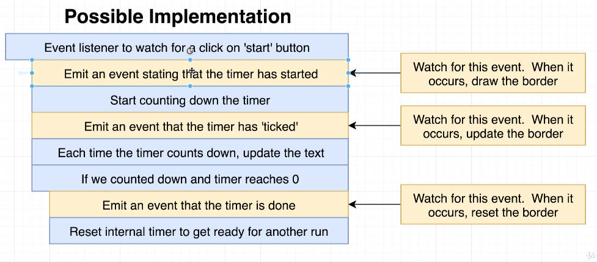
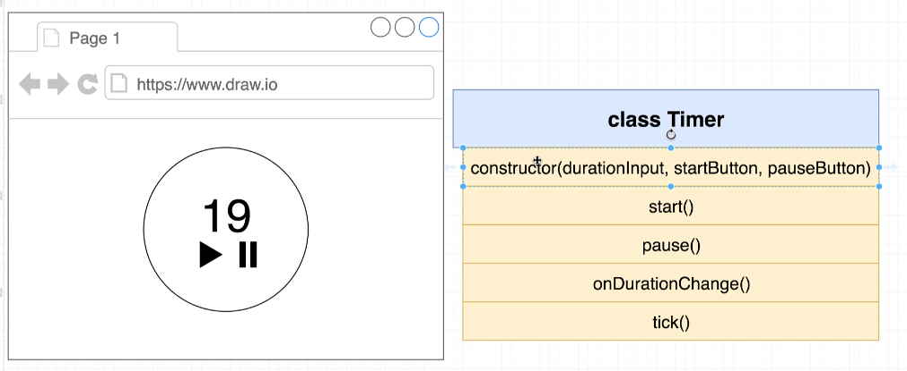

# About

This project will create a timer app, where the Timer will be set as an Input field which can be manipulated by the user.

## Things it does

- Displays a timer
- Shows an animated border around the timer

## Architecture approach

There exists different ways of implementation, one which refers just to fullfill the functionality

Event-based Architecture, which will be our approach:

We implement that stuff as a class

e whole repository is based on the Udemy course [The Modern Javascript Bootcamp Course](https://www.udemy.com/course/javascript-beginners-complete-tutorial/).
